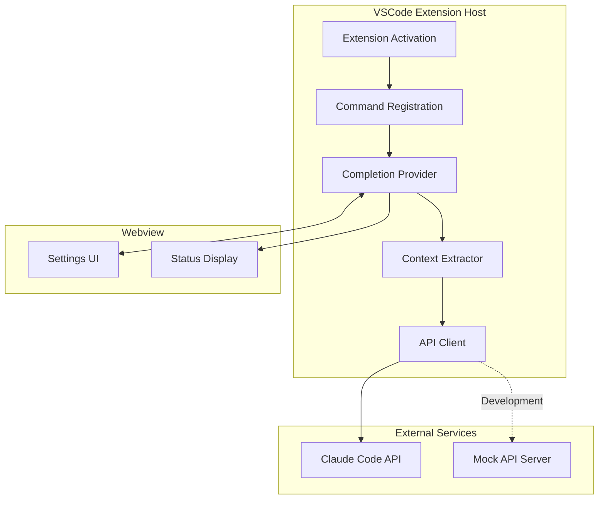

# Claude Code Continue - Development Guide

## Table of Contents
1. [Getting Started](#getting-started)
2. [Development Environment](#development-environment)
3. [Architecture Overview](#architecture-overview)
4. [Debugging](#debugging)
5. [Testing](#testing)
6. [Troubleshooting](#troubleshooting)
7. [Best Practices](#best-practices)

## Getting Started

### Prerequisites
- Node.js 18.0 or higher
- npm 8.0 or higher
- Visual Studio Code 1.95.0 or higher
- Git (recommended)

### Initial Setup
1. Clone the repository:
   ```bash
   git clone <repository-url>
   cd continue-cc
   ```

2. Install dependencies:
   ```bash
   npm install
   ```

3. Validate your environment:
   ```bash
   npm run validate-env
   # or
   node scripts/validate-env.js
   ```

4. Generate test data:
   ```bash
   node scripts/generate-test-data.js
   ```

## Development Environment

### Quick Start
Run the unified development environment:
```bash
npm run dev
```

This command will:
- ✅ Check and install dependencies if needed
- 🔧 Start TypeScript compiler in watch mode
- 🔄 Start extension watcher with auto-reload
- 🌐 Start webpack dev server for webview (port 9000)
- 🎭 Start mock API server (port 3001)

### Manual Process Management
If you prefer to run processes individually:

```bash
# Terminal 1: TypeScript compilation
npm run watch

# Terminal 2: Extension auto-reload
npm run watch:extension

# Terminal 3: Webview dev server
npm run watch:webview

# Terminal 4: Mock API server
node src/dev/mockServer.js
```

### Available Scripts
- `npm run compile` - Compile TypeScript
- `npm run watch` - Watch and compile TypeScript
- `npm run lint` - Run ESLint
- `npm run test` - Run tests
- `npm run build:dev` - Development build
- `npm run build:prod` - Production build
- `npm run dev` - Start full dev environment
- `npm run validate-env` - Check environment setup

## Architecture Overview



### Project Structure
```
continue-cc/
├── src/
│   ├── extension.ts          # Extension entry point
│   ├── providers/            # Completion providers
│   ├── api/                  # API client implementation
│   ├── utils/                # Utility functions
│   ├── webview/              # Webview UI code
│   └── dev/                  # Development tools
├── scripts/                  # Build and dev scripts
├── test/                     # Test files
├── .vscode/                  # VSCode configurations
│   ├── launch.json          # Debug configurations
│   └── tasks.json           # Build tasks
└── docs/                     # Documentation
```

## Debugging

### Extension Debugging
1. Open the project in VSCode
2. Press `F5` or select "Run Extension" from the debug panel
3. A new VSCode window will open with the extension loaded
4. Set breakpoints in your TypeScript files
5. Use the Debug Console to see console output

### Webview Debugging
1. Run the extension in debug mode
2. Open a webview in the extension
3. Right-click in the webview and select "Inspect" (or use Developer Tools)
4. Chrome DevTools will open for webview debugging

### Debug Configurations
The project includes several debug configurations in `.vscode/launch.json`:

- **Run Extension**: Standard extension debugging
- **Run Extension Tests**: Debug test execution
- **Debug Webview**: Attach to webview for debugging
- **Attach to Extension Host**: Attach to running extension
- **Extension + Webview**: Debug both simultaneously

### Debug Output Channel
The extension creates a dedicated output channel "Claude Code Continue" for logging:
```typescript
import { logger } from './utils/logger';

logger.info('Extension activated');
logger.debug('Debug information', { data });
logger.error('Error occurred', error);
```

View logs: View → Output → Select "Claude Code Continue" from dropdown

## Testing

### Running Tests
```bash
# Run all tests
npm test

# Run tests in watch mode
npm run test:watch

# Run tests with coverage
npm run test:coverage
```

### Test Structure
```
test/
├── unit/                    # Unit tests
├── integration/             # Integration tests
└── e2e/                     # End-to-end tests
```

### Writing Tests
```typescript
import * as assert from 'assert';
import { myFunction } from '../src/myModule';

suite('MyModule Test Suite', () => {
    test('should return expected value', () => {
        const result = myFunction('input');
        assert.strictEqual(result, 'expected');
    });
});
```

## Troubleshooting

### Common Issues

#### Extension doesn't activate
- Check the output panel for errors
- Ensure all dependencies are installed: `npm install`
- Verify minimum VSCode version (1.95.0)

#### TypeScript compilation errors
- Run `npm run compile` to see detailed errors
- Check `tsconfig.json` for correct configuration
- Ensure TypeScript version matches: `npm ls typescript`

#### Hot reload not working
- Check if nodemon is running: `ps aux | grep nodemon`
- Verify file watchers are active
- Try restarting the dev environment: `npm run dev`

#### Webview not updating
- Check webpack dev server is running on port 9000
- Clear browser cache in DevTools
- Verify webpack configuration in `webpack.config.js`

#### Mock API server issues
- Check if port 3001 is available: `lsof -i :3001`
- View mock server logs in the dev console
- Verify mock responses in `src/dev/mockServer.js`

### Port Conflicts
If you encounter port conflicts:
```bash
# Find process using a port
lsof -i :9000  # For webview dev server
lsof -i :3001  # For mock API server

# Kill process
kill -9 <PID>
```

### Environment Issues
Run the validation script to check your setup:
```bash
node scripts/validate-env.js
```

## Best Practices

### Code Style
- Follow TypeScript strict mode rules
- Use ESLint and Prettier for consistent formatting
- Write JSDoc comments for public APIs
- Keep functions small and focused

### Git Workflow
- Create feature branches for new work
- Write meaningful commit messages
- Run tests before committing
- Use conventional commit format

### Performance
- Debounce completion requests
- Cache API responses when appropriate
- Lazy load heavy dependencies
- Profile and optimize hot paths

### Security
- Never commit API keys or secrets
- Validate all user input
- Use HTTPS for API communication
- Follow VSCode extension security guidelines

### Extension Guidelines
- Follow VSCode Extension Guidelines
- Respect user settings and preferences
- Provide clear error messages
- Handle edge cases gracefully

## Development Workflow

### Daily Development
1. Start dev environment: `npm run dev`
2. Open VSCode and press F5 to debug
3. Make changes - see them hot reload
4. Run tests: `npm test`
5. Commit changes with meaningful messages

### Before Pull Request
1. Run full test suite: `npm test`
2. Check linting: `npm run lint`
3. Build production: `npm run build:prod`
4. Update documentation if needed
5. Ensure all tests pass

### Release Process
1. Update version in `package.json`
2. Update CHANGELOG.md
3. Run `npm run build:prod`
4. Package extension: `vsce package`
5. Test packaged extension
6. Publish: `vsce publish`

## Additional Resources
- [VSCode Extension API](https://code.visualstudio.com/api)
- [Extension Guidelines](https://code.visualstudio.com/api/references/extension-guidelines)
- [TypeScript Documentation](https://www.typescriptlang.org/docs/)
- [Webpack Documentation](https://webpack.js.org/)